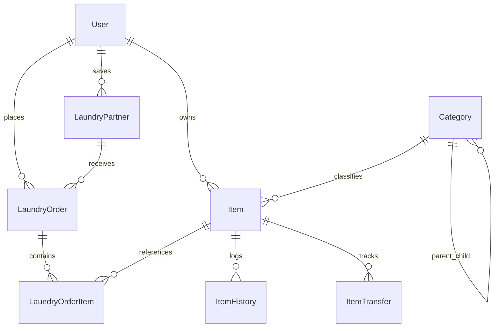

# ARANGTIK — MASTER CONSOLIDATED PRODUCT REQUIREMENTS DOCUMENT (PRD)

> **Document Version:** 2.0 (Consolidated & Enhanced)  
> **Status:** Approved Architecture & Specification  
> **Target Platform:** Node.js + Express.js + MongoDB + Vision/LLM AI  

---

## 1. Executive Summary & Vision

**Arangtik** is a unified, AI-powered personal wardrobe, household inventory, digital laundry management, and item lifecycle platform. 

### Core Product Principle
> *"Everything you own, where it is, what you should wear, what is being cleaned, and what is currently with someone else — all in one connected ecosystem."*

Arangtik solves real-world household problems:
1. **Digital Wardrobe & AI Dress Analysis:** Cataloging clothes effortlessly through AI image recognition, preventing duplicate purchases/entries, tracking wear history, and getting personalized styling advice.
2. **End-to-End Laundry (Dhobi) Ecosystem:** Seamlessly handing over clothes for wash, press, dry-cleaning, or repair with visual verification, WhatsApp/PDF receipts, and live status tracking between User and Dhobi.
3. **Household Inventory & Asset Tracking:** Keeping an organized record of electronics, jewelry, documents, appliances, and tools.
4. **Lending & Borrowing Lifecycle:** Tracking items lent to friends/relatives or borrowed, complete with due dates, reminders, and return confirmations.
5. **Future-Proof Extensibility:** Supporting 100–200+ dynamic categories, custom item actions, and pluggable AI models without requiring schema rewrites or table proliferation.

---

## 2. High-Level Architecture

```text
                                  ┌─────────────────────────────┐
                                  │      ARANGTIK PLATFORM      │
                                  └──────────────┬──────────────┘
                                                 │
                  ┌──────────────────────────────┴──────────────────────────────┐
                  │                                                             │
        ┌─────────▼─────────┐                                         ┌─────────▼─────────┐
        │     USER APP      │                                         │     DHOBI APP     │
        ├───────────────────┤                                         ├───────────────────┤
        │ • Wardrobe        │                                         │ • Orders Inbox    │
        │ • AI Photo Analys.│                                         │ • Item Verify     │
        │ • Wear History    │                                         │ • Status Flow     │
        │ • AI Stylist / VTO│                                         │ • WhatsApp Sync   │
        │ • Laundry Orders  │                                         │ • Delivery Track  │
        │ • Inventory/Lend  │                                         └─────────┬─────────┘
        └─────────┬─────────┘                                                   │
                  │                                                             │
                  └──────────────────────────────┬──────────────────────────────┘
                                                 │
                                     ┌───────────▼───────────┐
                                     │  EXPRESS REST BACKEND │
                                     └───────────┬───────────┘
                                                 │
                 ┌───────────────────────────────┼───────────────────────────────┐
                 │                               │                               │
       ┌─────────▼─────────┐           ┌─────────▼─────────┐           ┌─────────▼─────────┐
       │   MONGODB STORE   │           │  AI / VISION SVC  │           │   NOTIFICATION    │
       │ (Extensible Data) │           │ (Analysis/Embed)  │           │ (WhatsApp/Push)   │
       └───────────────────┘           └───────────────────┘           └───────────────────┘
```

---

## 3. Core Modules Breakdown

### Module 1: Authentication & User/Partner Profile
- **Roles:** User (Customer), Laundry Partner (Dhobi), Admin.
- **Auth Flow:** Mobile Number + OTP login, JWT authentication, Refresh token support.
- **Profiles:**
  - *User:* Name, photo, location, language preference, style/color preferences, sizing.
  - *Dhobi:* Business name, contact person, mobile/WhatsApp number, address, services offered (Wash, Iron, Dry-clean, Repair), pricing rates, working hours.

### Module 2: Extensible Category & Taxonomy System
- Dynamic multi-level categories (Category $\rightarrow$ Sub-category $\rightarrow$ Attributes template).
- Pre-seeded with core verticals:
  - **Wardrobe** (Upper wear, Lower wear, Traditional, Outerwear, Footwear, Accessories).
  - **Kitchen** (Appliances, Cookware, Tableware, Storage).
  - **Electronics** (Laptops, Cameras, Gadgets, Audio).
  - **Jewelry & Valuables** (Rings, Chains, Watches, Heirlooms).
  - **Documents** (Passports, Certificates, Deeds).
  - **Household & Tools** (Power tools, Hardware, Living essentials).
- Capable of expanding to 100+ categories dynamically without schema migrations.

### Module 3: Digital Wardrobe & AI Clothing Analysis *(Priority Phase 1)*
- **AI Dress Recognition:** Analyzes full outfit or single item from user photos/camera.
- **Smart Duplicate & Similarity Matcher:** Detects if an analyzed dress already exists in the wardrobe gallery or disambiguates similar items.
- **Wear Tracking:** Logs when outfits are worn, calculates wear frequency, and suggests rotation.
- **Care & Laundry Tracking:** Keeps live state of whether an item is in closet, in laundry, dirty, or lent.

### Module 4: AI Stylist & Recommendation Engine
- **Context-Aware Recommendations:** Suggests outfits based on weather (temperature, rain), occasion (wedding, office, casual, party), time of day, and past wear logs.
- **Wardrobe Synthesis:** Generates recommendations strictly from real items available in the user's closet (ignoring items currently in laundry or lent out).

### Module 5: Virtual Try-On (VTO)
- Visual simulation allowing user to overlay any wardrobe item or shopping preview onto their profile photo.
- Disclaimer-driven UX for visual styling estimation.

### Module 6: Laundry & Dhobi Management
- **Order Creation:** Select wardrobe items $\rightarrow$ Choose service (Wash, Press, Dry-clean, Stain removal, Tailoring/Repair) $\rightarrow$ Set expected delivery date $\rightarrow$ Special instructions.
- **Digital Order / PDF & WhatsApp Sharing:** Automatic invoice/item list generation with photos, QR codes, and WhatsApp deep links.
- **Dhobi Portal & Processing Flow:**
  - *Status Lifecycle:* `ORDER_CREATED` $\rightarrow$ `PICKUP_SCHEDULED` $\rightarrow$ `RECEIVED` $\rightarrow$ `IN_WASH` $\rightarrow$ `IN_IRONING` $\rightarrow$ `READY` $\rightarrow$ `OUT_FOR_DELIVERY` $\rightarrow$ `DELIVERED_AND_CONFIRMED`.
  - Item-level status sync back to user wardrobe.

### Module 7: Household Inventory & Asset Registry
- Unified item records across all household categories (brand, serial number, purchase date, price, warranty, cabinet/room location, photos, manuals).

### Module 8: Item Lending, Borrowing & Handover
- **Lending Flow:** Mark item as lent to a contact (name, phone, handover date, expected return date, purpose).
- **Status Tracking:** Item status transitions to `LENT_OUT`, location updates to borrower.
- **Return Workflow:** Automated reminders before due date, overdue alerts, return confirmation with condition check, and restoration to `AVAILABLE`.

### Module 9: Notifications & Reminders Engine
- Multi-channel notification pipeline (In-app Push, WhatsApp notifications, SMS fallback).
- Scheduled triggers for laundry ready, item return due, weather styling tips, and laundry pickup reminders.

### Module 10: Unified History & Audit Trail
- Timeline record for every item in the system:
  `Created -> Analyzed -> Worn -> Sent to Dhobi -> Washed & Ironed -> Received -> Lent out -> Returned`.

---

## 4. Universal Extensible Data Schema Design

To prevent schema rot and accommodate 100+ future categories, Arangtik adopts a **Core Unified Item Model** with schema-less attribute bags and strongly typed relations.

### 4.1 Core Entity Relationship



### 4.2 Core Item Schema Blueprint (`Item`)

```javascript
{
  _id: ObjectId,
  userId: ObjectId,                // Reference to User
  name: String,                    // e.g., "Navy Blue Slim Fit Shirt"
  category: ObjectId,              // Ref to Category (Wardrobe, Kitchen, Electronics, etc.)
  subCategory: ObjectId,           // Ref to SubCategory (Upper Wear -> Shirt)
  
  // Visuals & AI Data
  images: [{
    url: String,
    isPrimary: Boolean,
    embedding: [Number],          // AI visual vector embedding (512 or 768 dim)
    uploadedAt: Date
  }],
  
  // Dynamic Extensible Attributes (Wardrobe, Electronics, Kitchen, etc.)
  attributes: {
    // Wardrobe specific
    color: [String],               // e.g. ["Blue", "Navy"]
    pattern: String,              // e.g. "Checked", "Solid"
    fabric: String,               // e.g. "Cotton"
    clothingType: String,         // e.g. "Formal Shirt"
    gender: String,               // "Male", "Female", "Unisex"
    size: String,                 // "M", "L", "42"
    brand: String,                // "Zara"
    fit: String,                  // "Slim Fit"
    sleeveLength: String,         // "Full Sleeve"
    neckline: String,             // "Collar"
    suitableSeasons: [String],    // ["Summer", "Monsoon"]
    occasions: [String],          // ["Office", "Formal", "Casual"]
    
    // Inventory / Electronics / Other specific
    serialNumber: String,
    modelNumber: String,
    warrantyExpiry: Date,
    purchasePrice: Number,
    purchaseDate: Date,
    customProps: Map              // Open key-value for any future category
  },
  
  // Operational Status
  currentStatus: {
    type: String,
    enum: [
      'AVAILABLE',        // In wardrobe/closet ready to use
      'IN_USE',           // Currently being worn/used
      'DIRTY',            // Needs washing
      'IN_LAUNDRY',       // With Dhobi/laundry
      'IN_REPAIR',        // Tailor / repair shop
      'LENT_OUT',         // Given to friend/family
      'ARCHIVED'          // Donated/sold/discarded
    ],
    default: 'AVAILABLE'
  },
  
  // Physical Location
  currentLocation: {
    storageType: String,          // "CLOSET", "ROOM_CABINET", "DHOBI", "FRIEND", "OTHER"
    locationName: String,         // "Master Bedroom Closet - Shelf 2"
    assignedToPerson: {
      name: String,
      phone: String,
      relation: String
    }
  },
  
  // Wear / Usage Metrics
  usageStats: {
    wearCount: Number,            // Times worn
    lastWornDate: Date,
    washCount: Number,
    lastWashedDate: Date
  },
  
  isFavorite: Boolean,
  tags: [String],
  createdAt: Date,
  updatedAt: Date
}
```

---

## 5. End-to-End User & Dhobi Workflows

### 5.1 Wardrobe Creation & AI Photo Analysis Flow
1. **Photo Upload:** User snaps or selects a photo (wearing outfit or clothing item on hanger).
2. **AI Vision Pipeline:** Detects item bounding boxes, isolates garments, and classifies category, color, pattern, and style.
3. **Similarity & Deduplication Check:**
   - Visual vector embedding compared with existing wardrobe items.
   - **Scenario A (Exact/High Match > 90%):** Prompt: *"This dress is already in your wardrobe as 'Blue Zara Shirt'. Log wear history for today?"*
   - **Scenario B (Ambiguous Match 65%-90%):** Prompt: *"Is this dress the same as your 'Dark Blue Linen Shirt', or is this a new item?"*
   - **Scenario C (New Item < 65%):** Pre-fills wardrobe creation form with AI-extracted attributes for quick 1-tap save.

### 5.2 Laundry Handover & Dhobi Processing Flow
1. **Order Initiation:** User selects dirty wardrobe items, chooses Dhobi partner, service types (Wash / Iron / Dry-Clean), and pickup date.
2. **Order Generated:** System sets item status to `IN_LAUNDRY`, generates Order ID + PDF + WhatsApp summary message.
3. **Dhobi Intake & Visual Verification:**
   - Dhobi receives order link/WhatsApp.
   - Dhobi app opens order with visual cards of clothes.
   - Dhobi verifies items physically against the images on screen to prevent mix-ups.
4. **Dhobi Progress Updates:** Dhobi taps: `Received` $\rightarrow$ `Washing` $\rightarrow$ `Ironing` $\rightarrow$ `Ready` $\rightarrow$ `Delivered`.
5. **Customer Confirmation:** User receives live WhatsApp/Push notifications at each step. Upon delivery, user confirms and clothes return to `AVAILABLE` in closet.

---

## 6. Development Phasing Roadmap

| Phase | Module Focus | Core Deliverables |
|---|---|---|
| **Phase 1A** | **Wardrobe & AI Dress Analysis (PRIORITY)** | Wardrobe CRUD, AI vision upload analysis, duplicate & similarity disambiguation engine, wear tracking, closet status. |
| **Phase 1B** | **Dhobi & Laundry Module** | Dhobi portal, laundry orders, PDF/WhatsApp order generation, visual verification, live status sync with wardrobe. |
| **Phase 1C** | **AI Stylist & Outfits** | Weather API integration, occasion outfit recommendations based on available closet items. |
| **Phase 1D** | **Virtual Try-On (VTO)** | User avatar/photo try-on synthesis pipeline. |
| **Phase 1E** | **Household Inventory & Lending** | Universal item catalog, lending/borrowing lifecycle, due dates, reminder cron. |
| **Phase 1F** | **Notifications & Polish** | WhatsApp templates, push notifications, security audits, production deployment. |

---

## 7. Next Immediate Implementation Step
Proceed immediately with **Phase 1A: Wardrobe Module & AI Dress Analysis System**.  
Refer to the dedicated specification file: `WARDROBE_MODULE_REQUIREMENTS.md`.
